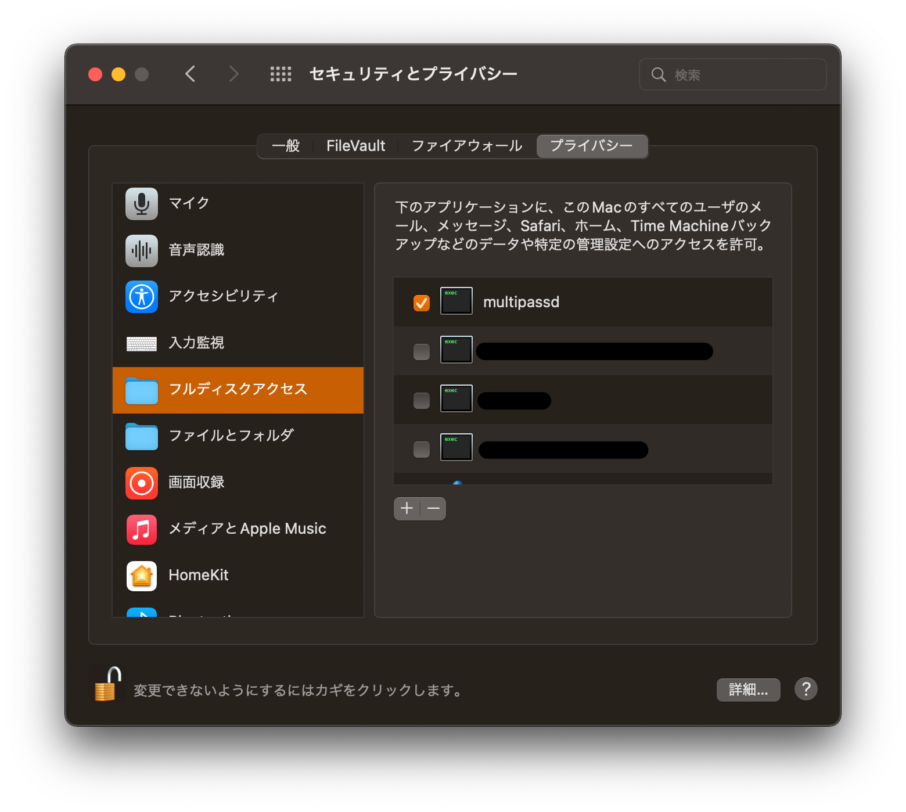

# training_webapi

何かを新しい技術を学習したいというお気持ちがあるけど、 API 作るの面倒だしちょっと使えそうなものだけでも作っておくかと思って作った Web API です。

## 動作確認及び開発環境

- macOS Monterey (12.5)
  - M1 Max
- Docker version 20.10.17, build 100c701
  - Docker Compose version v2.10.2
- Multipass
  - multipass   1.10.1+mac
  - multipassd  1.10.1+mac

## 始め方

### Docker

<details>

<summary>開く</summary>

1. Docker をインストールしてください

```shell
brew install --cask docker
```

2. 立ち上げます

すでにこのリポジトリがローカルにクローンもしくはダウンロードされているとします。

```shell
make docker_setup
```

しばらくするとプロンプトが現れるので

```shell
docker compose logs -f backend
```

と入力して

```text
training_backend  | 184 static files copied to '/app/staticfiles'.
training_backend  | [2021-11-23 14:51:07 +0000] [52] [INFO] Starting gunicorn 20.1.0
training_backend  | [2021-11-23 14:51:07 +0000] [52] [INFO] Listening at: unix:tmp/gunicorn.sock (52)
training_backend  | [2021-11-23 14:51:07 +0000] [52] [INFO] Using worker: gevent
training_backend  | [2021-11-23 14:51:07 +0000] [55] [INFO] Booting worker with pid: 55
```

上記のような表示が出るまで待ってください。上記のような表示が出たら control + C で抜け出して大丈夫です！

`http://127.0.0.1` でアクセス可能です。  
それではがんばりましょう！

</details>

### Multipass

<details>

<summary>開く</summary>

1. multipass をインストールしてください

```shell
brew install --cask multipass
```

2. ディスクへのアクセス許可

「システム環境設定」アプリから「セキュリティとプライバシー」を開き以下の画像のように設定してください。  
`multipassd` の項目が見つからない場合はプラスボタンを押して `/Library/Application Support/com.canonical.multipass/bin/multipassd` を追加してください。



3. 立ち上げます

すでにこのリポジトリがローカルにクローンもしくはダウンロードされているとします。

```shell
make multipass_setup
```

```text
184 static files copied to '/home/ubuntu/training_webapi/staticfiles'.
Created symlink /etc/systemd/system/multi-user.target.wants/gunicorn.service → /etc/systemd/system/gunicorn.service.
multipass info training
Name:           training
State:          Running
IPv4:           192.168.64.3
Release:        Ubuntu 20.04.3 LTS
Image hash:     f83575f6791e (Ubuntu 20.04 LTS)
Load:           2.64 1.53 0.63
Disk usage:     3.5G out of 9.5G
Memory usage:   331.3M out of 974.8M
Mounts:         /path/to/training_webapi => /home/ubuntu/training_webapi
                    UID map: 501:default
                    GID map: 20:default
```

上記のような表示が出るまで待ってください。  
最後に表示された `IPv4` のアドレスでアクセスが可能です。(上の例では: `http://192.168.64.3` )  
それではがんばりましょう！

</details>

## API 仕様

### ドキュメント

ユーザがタスクを作って、それぞれのタスクに対してコメントをすることが可能です。  
またユーザが作ったリソースについては作ったユーザのみがアクセス可能です。

詳細なドキュメントについては、上記セクションでサーバを起動して `http://{{ WebAPI の IPv4 アドレス }}/docs/swagger` にアクセスして確認してください。

### 認可

JWT を使用した認可を行います。

`POST /v1/users/sign-in` に対してユーザ名とパスワードを投げるとリフレッシュトークン(`refresh`) とアクセストークン(`access`) が取得できます。

<details>
<summary>Example</summary>

```shell
curl -X POST http://127.0.0.1/v1/users/sign-in \
     -H "Content-Type: application/json" \
     -H "Accept: application/json" \
     -d "{\"username\": \"sample-username\", \"password\": \"super-secret-password\"}"
```
</details>

#### 有効期限

- `refresh` : 1週間
- `access` : 1時間

アクセストークンの有効期限が切れた場合は `/v1/users/refresh` に `refresh` をキーにリフレッシュトークンを送信してください。

### 画像リソースの配信

この Web API では画像を扱うことが可能になっています。ストレージについては AWS S3 互換の MinIO を使用しています。  
容量制限については1回につき [15MB](dockerfiles/files/default.config#L9) としています。

- `/v1/tasks`
- `/v1/tasks/{id}`
- `/v1/tasks/{id}/comments`
- `/v1/tasks/{id}/comments/{comment_id}`

画像の ID として Web API からのレスポンスでキーが取得できます。このキーとホスト情報を組み合わせて URL を生成してください。

<details>
<summary>Example</summary>

Web API から以下のように返ってきたら

```text
training-store/images/e0b92214/8b69/4281/bcf6/67a7c4e88c90/83d34abb1fb5c77c0855ccae94fca4a9d74d4129.png
```

1. Docker

Web API が起動しているマシンの IP アドレスが `192.168.100.32` であるなら

```text
http://192.168.100.32:9000/training-store/images/e0b92214/8b69/4281/bcf6/67a7c4e88c90/83d34abb1fb5c77c0855ccae94fca4a9d74d4129.png
```

2. Multipass

```shell
multipass info training
```

で表示される `IPv4` アドレスが `192.168.64.3` であるなら

```text
http://192.168.64.3:9000/training-store/images/e0b92214/8b69/4281/bcf6/67a7c4e88c90/83d34abb1fb5c77c0855ccae94fca4a9d74d4129.png
```

上記のようにしてください。

</details>

### オリジン間リソース共有について

`^http(|s)://(localhost|127.0.0.1):\d+$` に一致するホストの場合、許可しています。

- `http://localhost:3000`
- `https://127.0.0.1:3000`

などが該当します。

```shell
python scripts/check_cors.py --url http://127.0.0.1:3000
```

で確認できます。

### メンテナンスモード

下記コマンドでメンテナンスモードを切り替えることができます。

1. Docker

```shell
make docker_maintenance_on
make docker_maintenance_off
```

2. Multipass

```shell
make multipass_maintenance_on
make multipass_maintenance_off
```

任意のエンドポイントへのアクセスで以下のようなレスポンスが返ってきます。

```json
{
  "error_detail": {
    "title": "現在サービスはメンテナンス中です。",
    "body": "終了は2021年11月28日 2時00分を予定しています。"
  }
}
```

## その他

### `Multipass` で仮想マシンが動いている状態で母艦を再起動した場合、正常に仮想マシンが起動しない

データをマウントする仕組みを取り入れているので一度インスタンスを削除してからもう一度母艦を再起動し再度インスタンスを立ち上げてください。

```shell
make multipass_cleanup
sudo reboot
# 以下、再起動後
make multipass_setup
```

2022/01/03現在

## License

This software is licensed under the MIT License (See [LICENSE](LICENSE)).
